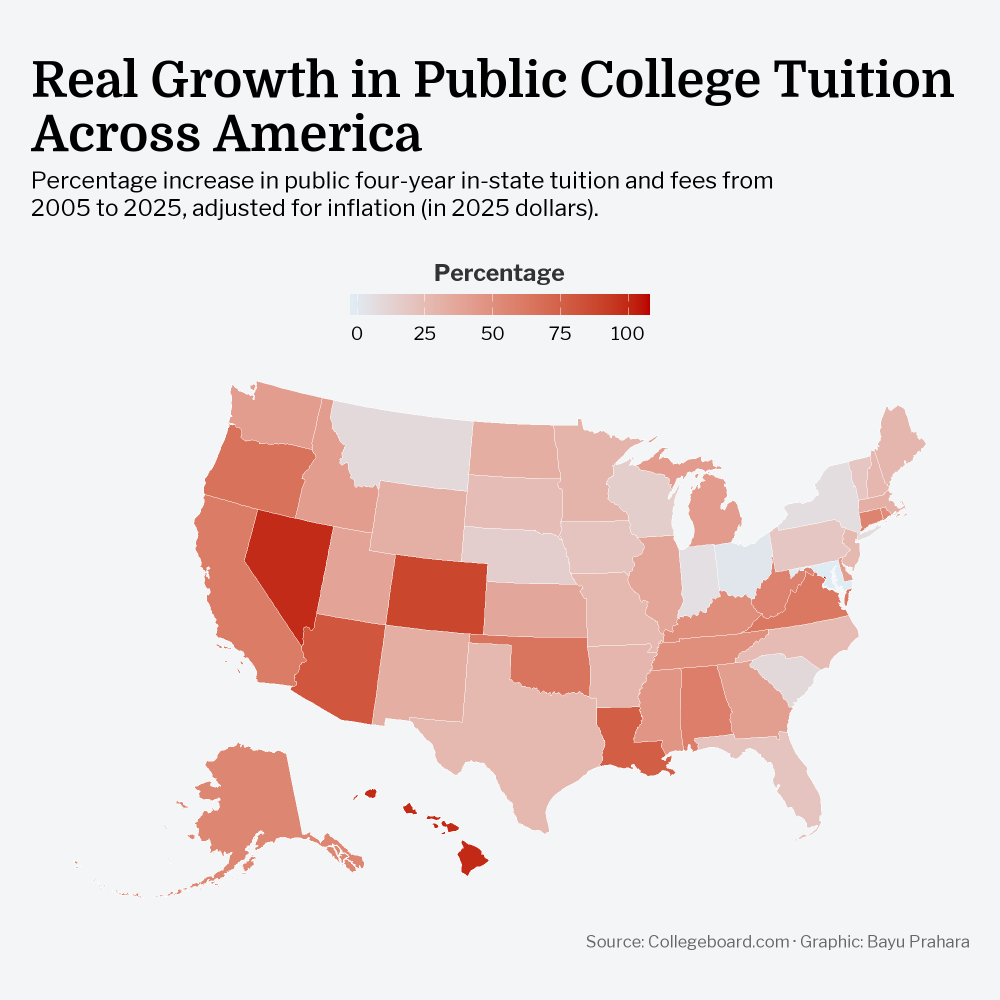

# TidyTuesday: US Tuition Growth (2005-2025)

## Overview
Visualization of percentage increase in public four-year in-state tuition and fees across U.S. states from 2005 to 2025, adjusted for inflation (in 2025 dollars).

## Key Findings
- Nevada, Hawaii, and Arizona experienced the highest tuition increases (90%+)
- Even after adjusting for inflation, most states saw significant growth in college costs
- Western states lead the tuition surge

## Data Source
[College Board](https://view.officeapps.live.com/op/view.aspx?src=https%3A%2F%2Fresearch.collegeboard.org%2Fmedia%2Fxlsx%2FTrends-in_College-Pricing-2025-excel-data.xlsx&wdOrigin=BROWSELINK)

## Tools
- R (tidyverse, sf, tigris, showtext)
- ggplot2 for visualization

## Visualization
