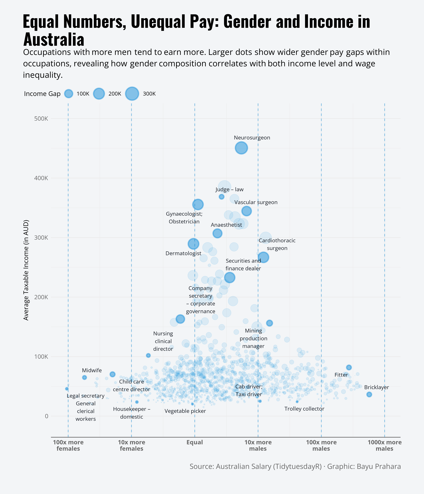

# TidyTuesday: Equal Numbers, Unequal Pay: Gender and Income in Australia

## Overview
This visualization explores how average taxable income and gender composition vary across Australian occupations in the 2015–2016 tax year. The chart maps each occupation by its female-to-male participation ratio and average taxable income, while point size encodes the income gap between men and women.

## Key Findings
- Male-dominated occupations tend to cluster at higher average taxable incomes, while female-dominated occupations concentrate in lower-paying roles.
- Larger points, indicating wider income gaps, appear more frequently in higher-income, male-dominated jobs such as surgeons, judges, and senior corporate roles.
- Some low-paid occupations with more balanced or female-dominated workforces (for example, care, clerical, and domestic roles) show relatively small income gaps but remain far below the earnings of high-income, male-dominated professions.

## Data Source
- Australian Taxation Office data as prepared for the [TidyTuesday 2018-04-23 episode](https://github.com/rfordatascience/tidytuesday/tree/master/data/2018/2018-04-23)
- Accessed in R with the `tidytuesdayR` package.

## Tools
- R (tidyverse, tidytuesdayR, ggrepel, ggtext, showtext, scales)
- ggplot2 for visualization

## Visualization

