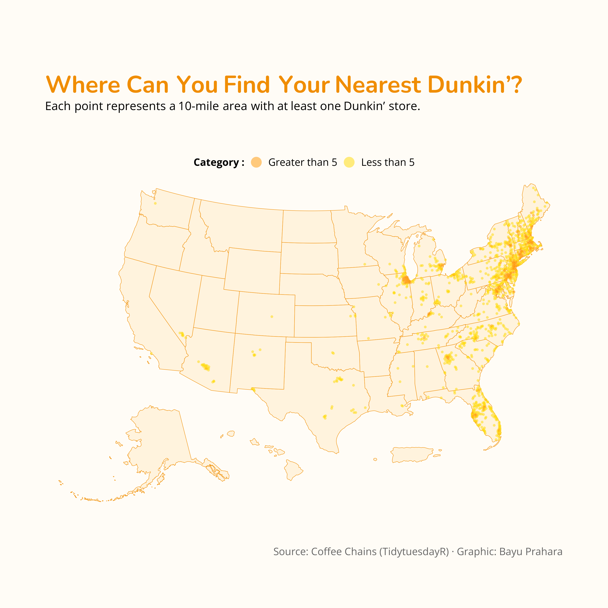

# TidyTuesday: Dunkin' Donuts Store Locations Across the U.S.

## Overview
This visualization maps the distribution of Dunkin' Donuts store locations across the United States using a grid-based spatial analysis. Each point represents a 10-mile radius grid cell, color-coded by store density to reveal regional patterns.

## Key Findings
- Dunkin' Donuts stores are heavily concentrated along the East Coast, particularly in New England, the Mid-Atlantic, and Florida.
- Most grid cells contain 5 or fewer stores, with denser clusters appearing in major metropolitan areas on the East Coast.

## Data Source
- Coffee chain store locations from the [TidyTuesday 2018-05-07 dataset](https://github.com/rfordatascience/tidytuesday/tree/master/data/2018/2018-05-07).
- Accessed in R with the `tidytuesdayR` package.

## Tools
- R (tidyverse, tidytuesdayR, sf, tigris, ggrepel, ggtext, showtext, scales)
- ggplot2 for visualization

## Visualization

