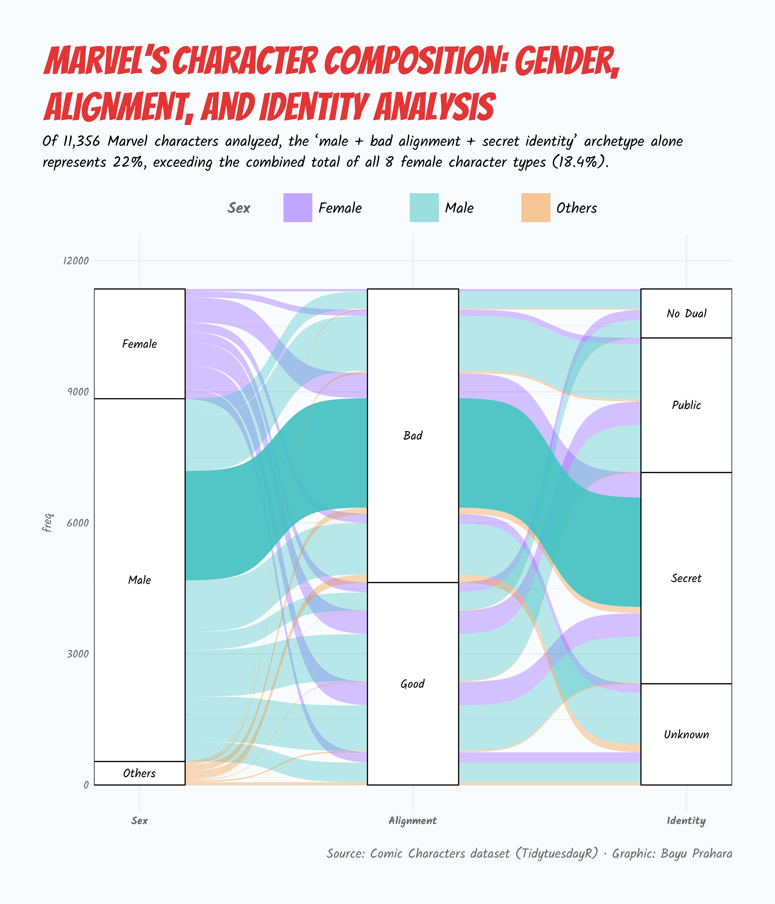

# TidyTuesday: Marvel's Character Composition - Gender, Alignment, and Identity Analysis

## Overview
This alluvial diagram visualizes Marvel's character roster across three dimensions: gender, alignment (good vs. bad), and identity type (secret, public, etc.). Analysis of 11,356 Marvel characters reveals unique patterns in character composition.

## Key Findings
- **The "male villain with secret identity" archetype dominates**: Male characters with bad alignment and secret identities alone comprise 22% of the entire roster—more than all female character types combined.
- **Bad characters outnumber good**: Across all genders, villainous characters are more prevalent than heroic ones, reflecting Marvel's focus on morally complex narratives.

## Data Source
- Comic Characters dataset from [TidyTuesday (2020-09-29)](https://github.com/rfordatascience/tidytuesday/tree/main/data/2020/2020-09-29), filtered to Marvel characters only.

## Tools
- R (tidyverse, ggplot2, scales, ggtext, showtext)
- ggplot2 and ggalluvial for visualization

## Visualization

