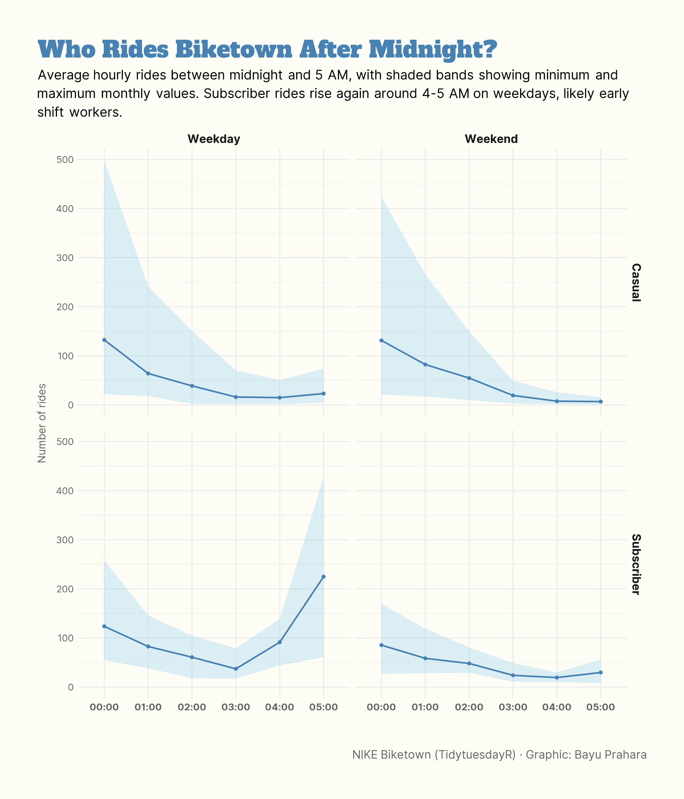

# TidyTuesday: Who Rides Biketown After Midnight?

## Overview
This line chart shows NIKE Biketown ridership patterns between midnight and 5 AM during 2016-2017. The visualization compares casual riders and subscribers, and weekday versus weekend nights in Portland. Shaded bands represent the monthly minimum and maximum values.

## Key Findings
- **Casual riders gradually decrease through the night**: Both weekday and weekend casual ridership drops steadily from midnight to 5 AM, indicating these are mainly nightlife-related trips ending.
- **Subscribers show increased activity at 4-5 AM on weekdays**: There is a clear rise in subscriber usage around 4-5 AM on weekdays, likely representing early shift workers and morning commuters.
- **Weekend nights have minimal activity**: Both casual and subscriber ridership remains very low throughout weekend nights, showing few people cycle after dark on weekends.

## Data Source
- NIKE Biketown dataset from [TidyTuesday](https://github.com/rfordatascience/tidytuesday/tree/main/data/2018/2018-06-05)

## Tools
- R (tidyverse, lubridate, ggplot2)

## Visualization

