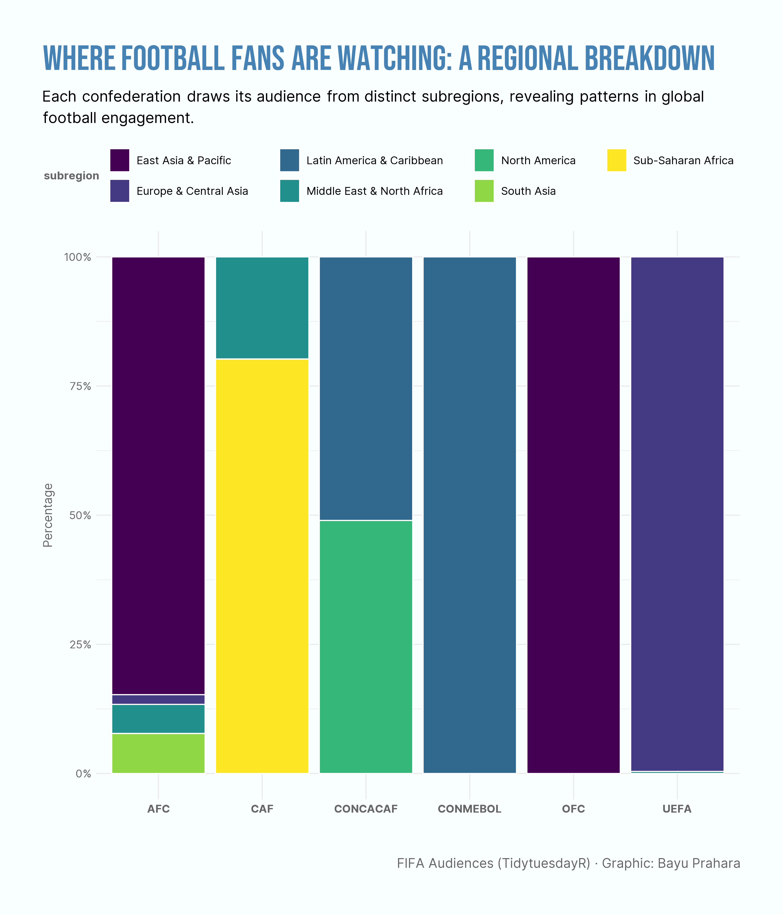

# TidyTuesday: Where Football Fans Are Watching - A Regional Breakdown

## Overview
This stacked bar chart shows how football audiences are spread across different regions for each FIFA confederation. The visualization helps us understand which subregions watch football the most and reveals interesting patterns in global football viewership.

## Key Findings
- **East Asia & Pacific dominates AFC**: The Asian Football Confederation gets almost all of its audience from East Asia & Pacific, showing that viewers in this region are very interested in football.
- **Sub-Saharan Africa is the main audience for CAF**: The African confederation's audience comes mostly from Sub-Saharan Africa, which makes up about 75% of viewers, while the Middle East & North Africa provides the rest.
- **Americas are important for CONMEBOL and CONCACAF**: Both of these confederations rely heavily on audiences from Latin America & Caribbean and North America, showing strong football interest in the Americas region.

## Data Source
- FIFA Audiences dataset from [TidyTuesday](https://github.com/rfordatascience/tidytuesday/tree/main/data/2018/2018-06-12)

## Tools
- R (ggplot2, dplyr, tidyverse, countrycode)

## Visualization

