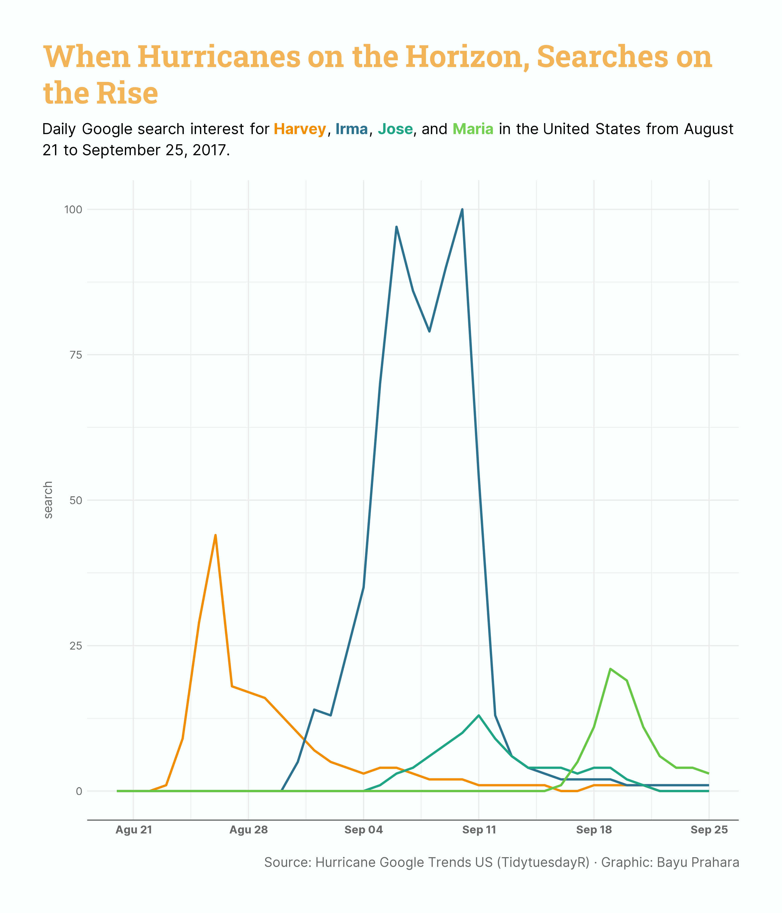

# TidyTuesday: When Hurricanes on the Horizon, Searches on the Rise

## Overview
This line chart shows daily Google search interest for four major 2017 Atlantic hurricanes such as Harvey, Irma, Jose, and Maria in the United States. The visualization uses color-coded lines to track how public attention rose and fell from August 21 to September 25, 2017, around the time each storm threatened or impacted land.

## Key Findings
- **Public interest spikes sharply around landfall events**: Each hurricane shows a clear jump in Google searches around the time it is strongest or about to hit land, as people look for updates and safety information.
- **Harvey and Irma dominate overall search volume**: The lines for Harvey and Irma reach higher peaks than Jose and Maria, suggesting they received more media coverage and were seen as more dangerous.
- **Attention drops quickly after the peak**: For all four storms, Google searches drop soon after the main impact period, showing that public attention moves on once the immediate danger is over.

## Data Source
- Hurricane Google Trends US dataset from [TidyTuesday](https://github.com/rfordatascience/tidytuesday/tree/main/data/2018/2018-06-19)

## Tools
- R (tidyverse, tidytuesdayR, ggplot2, ggtext, showtext, scales)

## Visualization

