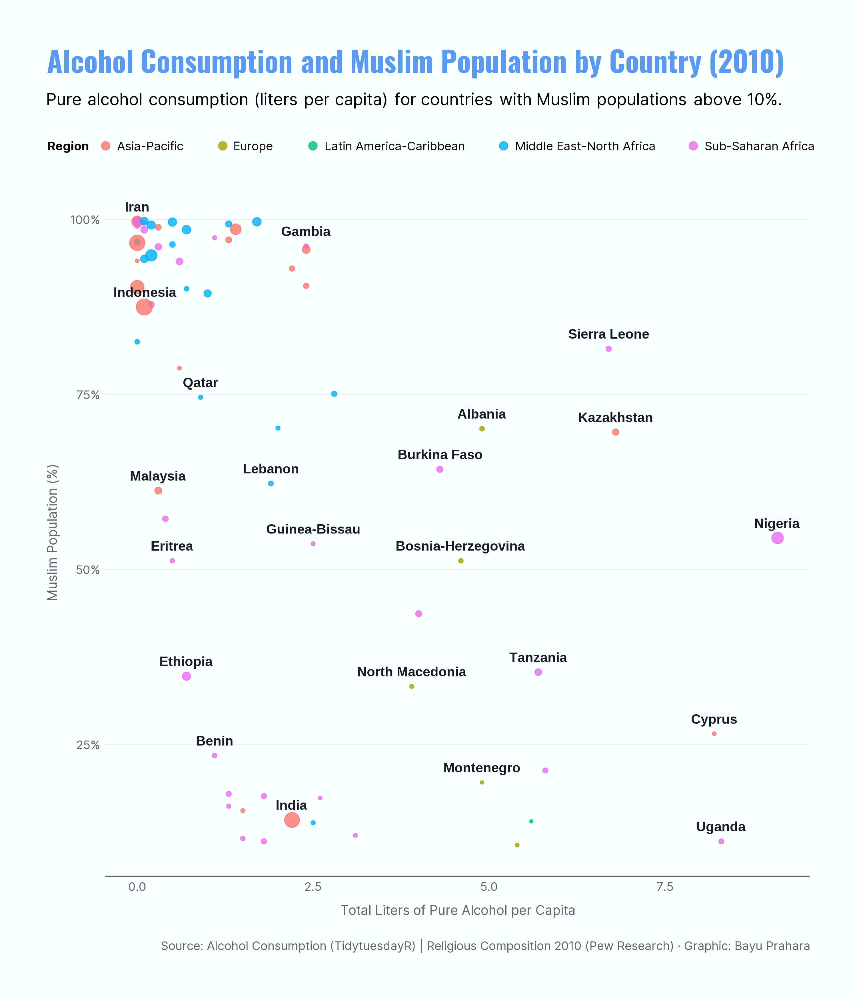

# TidyTuesday: Alcohol Consumption and Muslim Population by Country (2010)

## Overview
This scatter plot compares alcohol consumption and Muslim population percentage across countries in 2010. Each dot represents a country with more than 10% Muslim population. The horizontal axis shows average pure alcohol consumption per person (in liters), while the vertical axis shows the percentage of Muslims in each country. Dot color indicates the world region, and dot size reflects the total Muslim population.

This visualization does not suggest any causal relationship between the two variables. Instead, it shows how these factors vary independently across different countries and regions.

## Key Findings
- **No clear pattern between Muslim population and alcohol consumption**: Countries with high Muslim populations show widely different alcohol consumption levels, ranging from nearly zero to moderate amounts. This suggests other factors (culture, laws, economics, etc.) play stronger roles than religious composition alone.
- **Regional differences matter more**: European countries with significant Muslim populations (Bosnia-Herzegovina, Albania, North Macedonia) show higher alcohol consumption than many countries in the Middle East–North Africa region, even when Muslim percentages are similar.
- **Large Muslim populations do not predict consumption**: Countries like Indonesia, India, and Nigeria have large Muslim populations but very different alcohol consumption patterns, showing that population size and drinking behavior are not connected in a predictable way.
- **Wide diversity within regions**: Even within single regions like Sub-Saharan Africa or Asia-Pacific, alcohol consumption varies greatly regardless of Muslim population share.

## Data Source
- **Alcohol consumption**: `week13_alcohol_global` dataset from [TidyTuesday (2018-06-26)](https://github.com/rfordatascience/tidytuesday/tree/main/data/2018/2018-06-26)
- **Religious composition**: Religious Composition by Country 2010–2020 from [Pew Research Center](https://www.pewresearch.org/religion/feature/religious-composition-by-country-2010-2020/) (2010 data)

## Tools
- R (`tidyverse`, `tidytuesdayR`, `ggplot2`, `ggrepel`, `ggtext`, `showtext`, `scales`)

## Visualization

