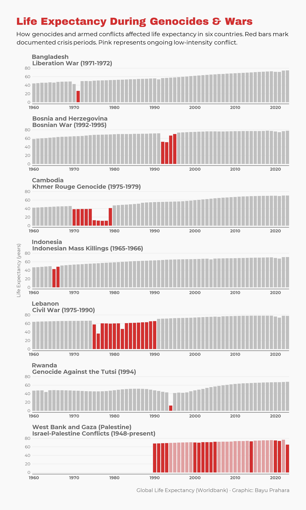

# TidyTuesday: Life Expectancy During Genocides & Wars

## Overview
This faceted bar chart visualizes life expectancy at birth across seven countries that experienced genocides or armed conflicts from 1960 to 2023. Each panel shows a country's life expectancy trajectory, with color-coded bars distinguishing normal years (gray), ongoing conflict periods (pink), and acute crisis years (red). The visualization reveals how historical atrocities left measurable marks on human lifespan data.

## Key Findings
- **Cambodia's dramatic collapse (1975-1979)**: The Khmer Rouge genocide caused life expectancy to plummet from ~45 years to ~10-15 years. The most severe decline in the dataset.
- **Lebanon's prolonged crisis (1975-1990)**: Unlike acute genocides, Lebanon's 15-year civil war created sustained suppression of life expectancy, showing chronic conflict's different impact pattern.
- **Rwanda's sharp dip and recovery (1994)**: The 1994 genocide shows a sharp one-year decline, but life expectancy recovered relatively quickly afterward compared to Cambodia.
- **Israel-Palestine Conflicts (1948-present)**: The First Intifada (1990-1993) and Second Intifada (2000-2005) show as red periods, with ongoing moderate tension in pink, reflecting a different conflict trajectory than acute genocides.
- **Bosnia's concentrated impact (1992-1995)**: The Bosnian War's concentrated timeline creates a visible dip, with recovery beginning shortly after the Dayton Accords.
- **Indonesia and Bangladesh's brief shocks (1965-1966, 1971)**: Both show sharp single-year or two-year declines followed by rapid recovery, suggesting more localized impact.

## Data Source
- Life expectancy at birth, total (years) [Worldbank](https://data.worldbank.org/indicator/SP.DYN.LE00.IN)
- **Crisis periods marked**: Based on documented historical events from Wikipedia and academic sources

## Tools
- R (tidyverse, WDI, showtext, scales)

## Visualization
