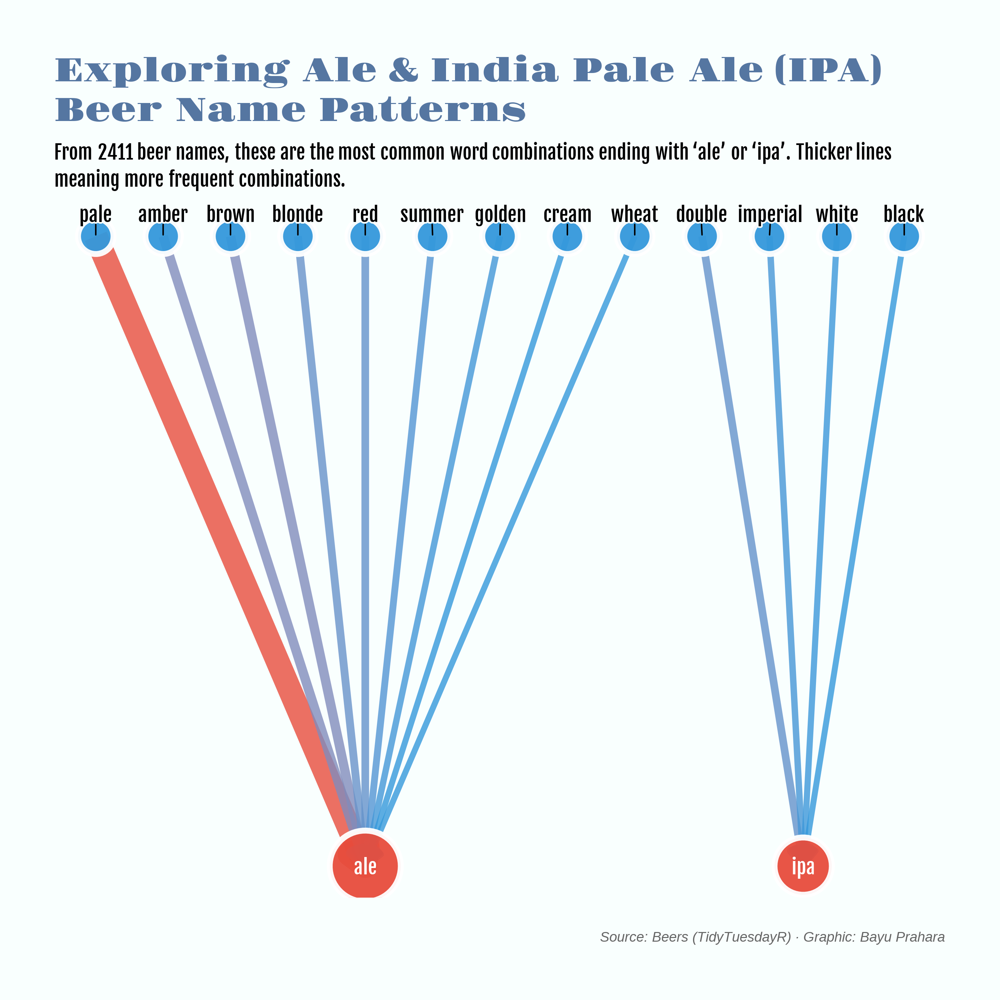

# TidyTuesday: Beer Name Patterns

## Overview
This directed graph maps sequential word chains in 2,411 beer names from the TidyTuesday dataset. Blue descriptor nodes (pale, brown, blonde, golden, etc.) connect to red style nodes (ale, ipa, lager, stout) via arrows indicating word order. Arrow thickness encodes frequency, highlighting common naming conventions such as “pale ale” or “brown ale” The visualization reveals how descriptors cluster around core beer styles, illustrating linguistic patterns in brewery naming traditions.

## Key Findings
- **Pale Ale dominates**: "Pale" → "Ale" is the most frequent combination, appearing more times than any other descriptor-style sequence.

## Data Source
- Beers dataset [TidyTuesday 2018-07-10](https://github.com/rfordatascience/tidytuesday/blob/main/data/2018/2018-07-10/week15_beers.xlsx)

## Tools
- R (tidyverse, tidytext, igraph, ggraph, showtext, tidytuesdayR)

## Visualization

