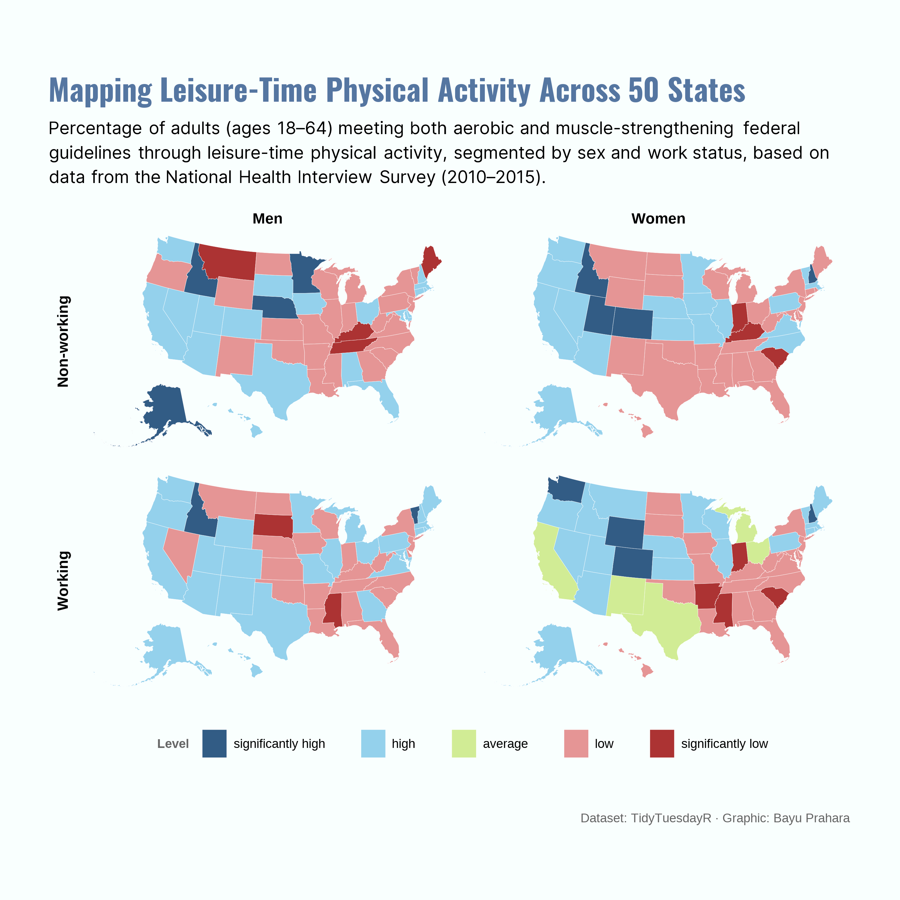

# TidyTuesday: Leisure-Time Physical Activity Across 50 States

## Overview
This choropleth map visualizes the percentage of adults aged 18–64 who meet both aerobic and muscle-strengthening federal guidelines through leisure-time physical activity across the United States, segmented by sex and work status. The 2×2 facet grid (Working/Non-working × Men/Women) reveals geographic patterns and demographic variations in physical activity participation, with color intensity indicating activity levels from significantly high to significantly low based on the National Health Interview Survey data (2010–2015).

## Key Findings
- **Geographic variation dominates**: State location is a stronger predictor of physical activity levels than gender or work status. Colorado, Utah, and Idaho consistently show high participation across all demographic groups, while Southern states exhibit lower levels.
- **Persistent gender gap**: Men maintain higher physical activity participation than women across all states and work statuses.
- **Weak work-status correlation**: The expected relationship between employment status and leisure-time physical activity is surprisingly weak or inconsistent. Some states show non-working populations with equal or higher activity rates than working populations, suggesting that age composition (retirees vs. unemployed) and socioeconomic access to facilities play significant hidden roles.
- **Climate and culture matter**: Mountain West states and cool-climate regions (Maine, Minnesota) show notably higher participation, hinting at outdoor activity traditions and indoor gym infrastructure differences.

## Data Source
- National Health Interview Survey (NHIS) Exercise dataset [TidyTuesday 2018-07-17](https://github.com/rfordatascience/tidytuesday/blob/main/data/2018/2018-07-17/week16_exercise.xlsx)

## Tools
- R (tidyverse, tidytuesdayR, sf, tigris, showtext, ggtext, scales, cowplot, viridis)

## Visualization

