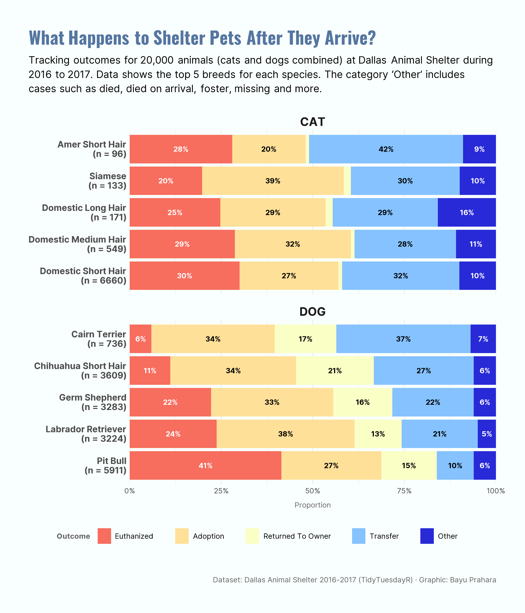

# TidyTuesday 2018-07-31: What Happens to Shelter Pets After They Arrive?

## Overview
Horizontal stacked bar chart showing outcome proportions for top 5 cat & dog breeds at Dallas Animal Shelter (2016-2017). Each bar totals 100% with sample sizes displayed, highlighting stark differences in **Return to Owner** (dog dominant) vs **Transfer** (cat dominant).

## Key Findings
- **DOGS go home**: 13-21% **Return to Owner** vs <2% for cats
- **CATS get transferred**: 28-42% **Transfer** vs 10-37% for dogs  
- **Pit Bulls**: Highest euthanasia rate (41%) among all breeds
- **Volume**: Domestic Short Hair Cat (6.6K) vs Pit Bull Dog (5.9K) dominate shelter intake

## Data Source
Dallas Animal Shelter outcomes via [TidyTuesday 2018 Week 31](https://github.com/rfordatascience/tidytuesday/tree/main/data/2018/2018-07-31)

## Tools
R (tidyverse, dplyr, ggplot2, ggtext, showtext, scales)

## Visualization

