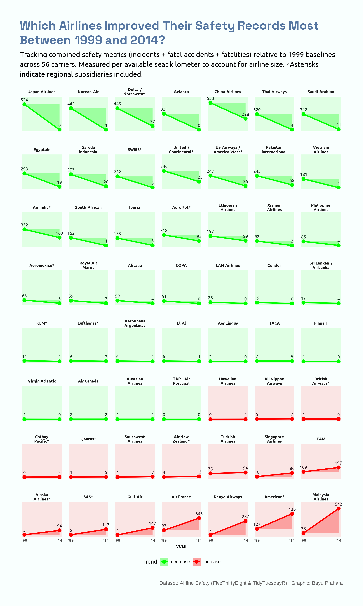

# TidyTuesday 2018-08-07: Which Airlines Improved Their Safety Records Most Between 1999 and 2014?

## Overview
This slope chart displays safety trends for 56 airlines between 1999 and 2014. Each facet shows one airline with ribbon area from 1999 baseline to 2014 value. Panels are ordered from largest decline (Japan Airlines) to biggest improvement (Malaysia Airlines). Red indicates increasing incidents, green shows improvement.

## Key Findings
- Japan Airlines reduced incidents by 524 (524 to 0).
- Malaysia Airlines saw largest increase (38 to 542 incidents).
- 38 airlines improved safety records (green).
- 18 airlines worsened (red).

## Data Source
[Airline Safety (FiveThirtyEight)](https://github.com/rfordatascience/tidytuesday/tree/main/data/2018/2018-08-07)
Original data covers fatal accidents by airline from 1985-1999 vs 2000-2014.

## Tools
R (tidyverse, showtext, ggtext, scales)

## Visualization

