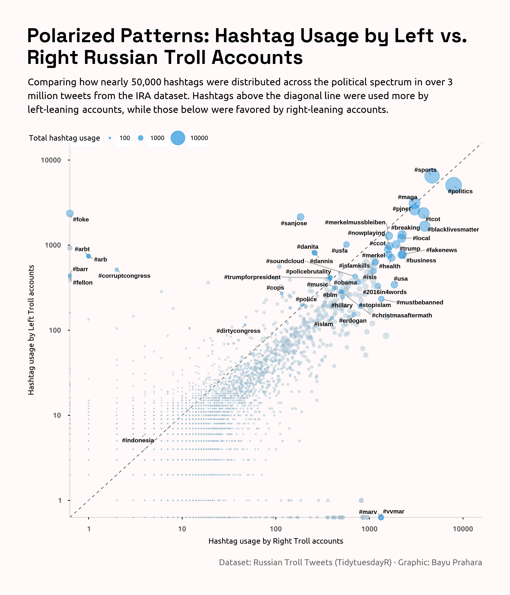

# TidyTuesday 2018-08-14: Polarized Patterns: Hashtag Usage by Left vs. Right Russian Troll Accounts

## Overview
Log-log scatterplot comparing hashtag usage between Left and Right Russian troll accounts from IRA dataset. Points show nearly 50,000 hashtags from over 3 million tweets. Size represents total mentions, with 14 key hashtags highlighted and labeled.

## Key Findings
- Right trolls dominate high-volume hashtags (above diagonal line)
- Low-volume hashtags cluster near diagonal (balanced usage)
- Total range spans 10 to 10,000+ mentions per hashtag

## Data Source
IRA Russian troll tweets via [TidyTuesday](https://github.com/fivethirtyeight/russian-troll-tweets)

## Tools
R (tidyverse, data.table, ggplot2, ggtext, ggrepel, showtext, scales)

## Visualization

