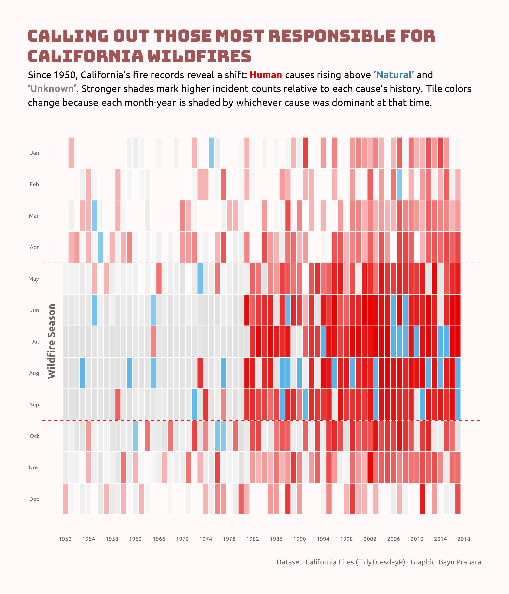

# TidyTuesday 2018-08-21: Calling Out Those Most Responsible For California Wildfires

## Overview
Heatmap visualization showing California wildfire causes across 68 years (1950-2017). Each tile represents a month-year combination, colored by the dominant cause (Human, Natural, or Unknown). Color intensity reflects relative incident counts within each cause's historical distribution, making patterns visible across different scales.

## Key Findings
- Human-caused fires dominate the wildfire season (May through September), shown by intense red shading
- Peak intensity occurs in summer months, particularly June through August
- Natural causes (green) appear sporadically, with no strong seasonal pattern
- Unknown causes (gray) are more common in winter months and early period (1950s-1970s)
- Clear seasonal demarcation: fire season shows consistently darker shades compared to off-season months

## Data Source
California wildfires dataset via [TidyTuesday](https://github.com/rfordatascience/tidytuesday/tree/main/data/2018/2018-08-21)

## Methods
Percentile-based color mapping using empirical cumulative distribution function (ecdf) for each cause category. Color gradients generated with colorRamp() to ensure robust visualization against outliers in skewed distributions.

## Tools
R (dplyr, ggplot2, TidyTuesdayR, Scales)

## Visualization

