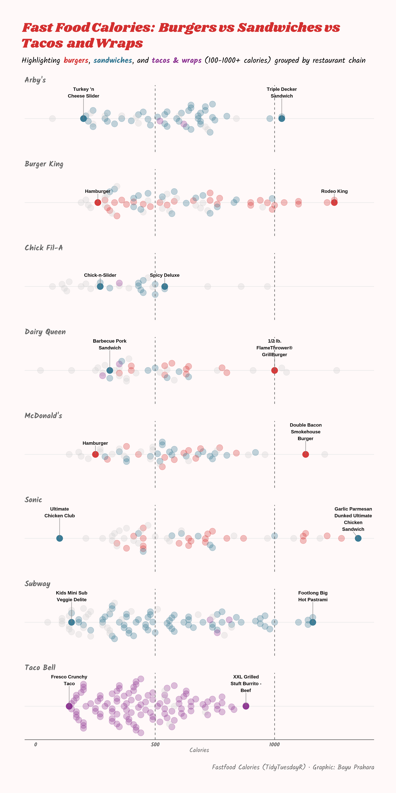

# TidyTuesday: Fast Food Calories Breakdown

## Overview
Beeswarm plot showing calorie content in fast food items from burgers, sandwiches, tacos, and wraps. Dots cluster by restaurant chain along a calorie axis from 0 to over 1000.

## Key Findings
- Burgers often hit 500-1000 calories across chains like McDonald's, Sonic, and Burger King.
- Tacos and wraps stay lower, mostly under 1000, with Taco Bell leading in variety.
- Sandwiches spread wide in Arby's and Subway.
- Overall, there are no highlighted items under 100 calories.

## Data Source
Fast food calories dataset via [TidyTuesday](https://github.com/rfordatascience/tidytuesday/tree/main/data/2018/2018-09-04)

## Tools
R (tidyverse, ggplot2, TidyTuesdayR, ggtext, scales, showtext)

## Visualization

