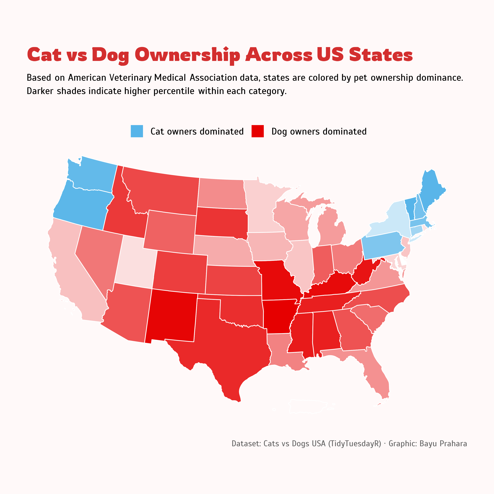

# TidyTuesday: Cat vs Dog Ownership Across US States

## Overview
Choropleth map showing pet ownership dominance across the United States. States are colored by whether dog or cat owners are more prevalent, with intensity reflecting the percentile ranking within each category.

## Key Findings
- Dog owners dominate most states, especially in the South and Midwest regions (Texas, Arkansas, Mississippi, Missouri).
- Cat owners dominate in the Northeast (Maine, Massachusetts, Vermont) and Pacific Northwest (Washington, Oregon).
- Color intensity reveals not just dominance but also the strength of preference. Darker shades indicate higher percentile within their category.
- Delaware shows a tie between cat and dog ownership percentages.

## Data Source
Cat and dog ownership data from the American Veterinary Medical Association via [TidyTuesday](https://github.com/rfordatascience/tidytuesday/tree/main/data/2018/2018-09-11)

## Tools
R (tidyverse, ggplot2, TidyTuesdayR, ggtext, scales, showtext, sf, tigris)

## Visualization

