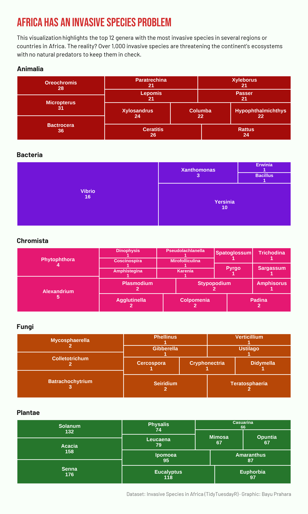

# TidyTuesday: Africa Has an Invasive Species Problem

## Overview
Treemap visualization showing the most invasive genera across major kingdoms (Plantae, Animalia, Fungi, Bacteria, Chromista) recorded in Africa. Each facet represents a kingdom, and each rectangle within a facet represents a genus, sized by the number of invasive species associated with that genus. The plot is designed to compare which genera dominate invasions within and across kingdoms while still keeping the focus on a compact set of top contributors.

## Key Findings
- A few **plant** genera (such as *Solanum*, *Acacia*, and *Senna*) account for a large share of invasive plant species in Africa, highlighting how uneven the invasion pressure is within Plantae.
- In **bacteria**, invasions are strongly dominated by a handful of genera like *Vibrio* and *Yersinia*, suggesting important implications for disease and biosecurity.
- **Chromista** and **Fungi** also show clear genus-level concentration.
- Even after restricting to the top genera per kingdom, the area balance between facets makes it clear that plants still play a leading role in terms of invasive species richness in this dataset.

## Data Source
Africa invasive species via [TidyTuesday](https://github.com/rfordatascience/tidytuesday/tree/main/data/2018/2018-09-25)

## Tools
R (tidyverse, ggplot2, TidyTuesdayR, ggtext, scales, showtext, treemapify, rotl)

## Visualization

