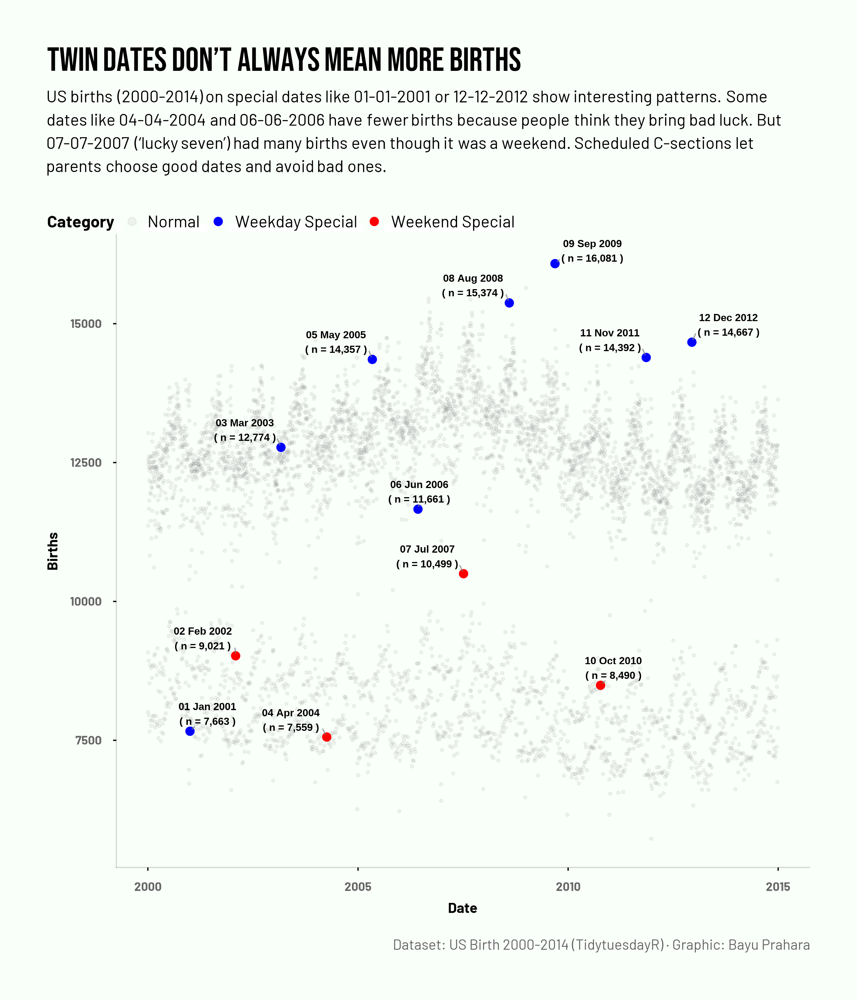

# TidyTuesday: Twin Dates Don't Always Mean More Births

## Overview
Scatter plot showing daily US births from 2000-2014, with special focus on twin date. Weekday special dates (blue) show clear spikes from scheduled C-sections, while weekend special dates (red) have lower births. Grey points show normal weekdays and weekends for comparison. Labels on special dates show exact birth counts.

## Key Findings
- **Weekday special dates** like 08-08-2008 (14k+) and 09-09-2009 show strong spikes despite 2008 recession lowering overall births.
- **Weekend special dates** like 04-04-2004 and 06-06-2006 have fewer births, possibly "bad luck" dates parents avoid.
- **Lucky exceptions**: 07-07-2007 ("lucky seven") had high weekend births (~12k).
- 01-01-2001 low due to New Year's holiday.

## Data Source
US births 2000-2014 via [TidyTuesday](https://github.com/rfordatascience/tidytuesday/tree/main/data/2018/2018-10-02)

## Tools
R (tidyverse, ggplot2, ggrepel, showtext, scales, ggtext)

## Visualization

